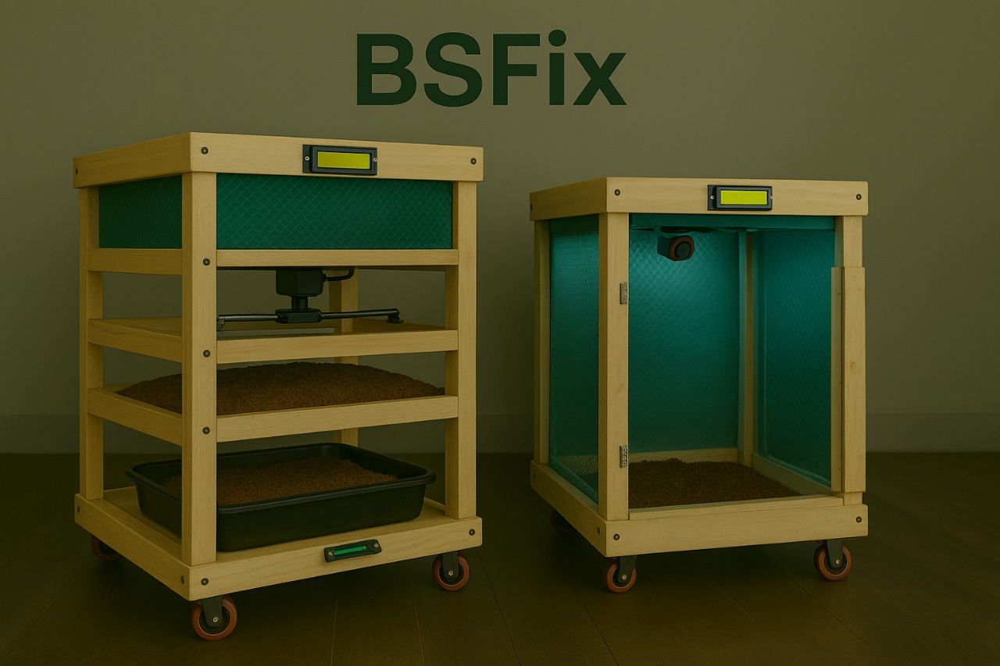

# 🪰 BSFix – Automated, IoT-Based Smart Black Soldier Fly Farming System

An integrated, intelligent system designed to automate and optimize **Black Soldier Fly (BSF)** farming — transforming organic waste into high-value byproducts using smart hardware, real-time monitoring, and AI.

---

## 🧪 1. BSF Breeding Unit – Smart Environment Optimizer

We’ve developed a custom **PCB-based control system** that monitors and regulates environmental parameters to **maximize BSF egg production**.

**Key Features**:
- 🌡️ Temperature, 💧 humidity, and 💡 light intensity sensors for real-time environment tracking.
- Built-in **humidifier** for moisture control.
- Adjustable LED lighting to simulate day/night cycles.
- Feedback control system for consistent and optimal breeding conditions.

---

## ♻️ 2. Composting Unit – Waste-to-Protein Converter

This unit receives **organic waste + BSF eggs** from the breeding unit and processes them into:
- 🐛 BSF larvae (for high-protein feed)
- 🌱 Organic compost (frass)

**Core Technologies**:
- **Raspberry Pi 4** as the main controller.
- **AMG8833 thermal camera** for real-time monitoring.
- 🧠 **Machine Learning** models (in progress) for:
  - Growth pattern recognition
  - Larval development tracking
  - Compost health analysis

---

## 🌐 BSFix Mobile App & Web Platform – Smart Circular Marketplace

Our digital platform bridges the gap between **farmers, composting sites, and buyers**.

**Platform Features**:
- Real-time sensor data access
- Visual heatmaps and analytics
- Digital marketplace for larvae, compost, and services
- Performance alerts and smart recommendations

---

## ✅ System Highlights

- Custom hardware and firmware  
- IoT-powered real-time monitoring  
- Thermal image-based larval tracking  
- Edge ML integration (planned)  
- Mobile + Web platform for interaction  
- Scalable from homes to industrial farms

---

